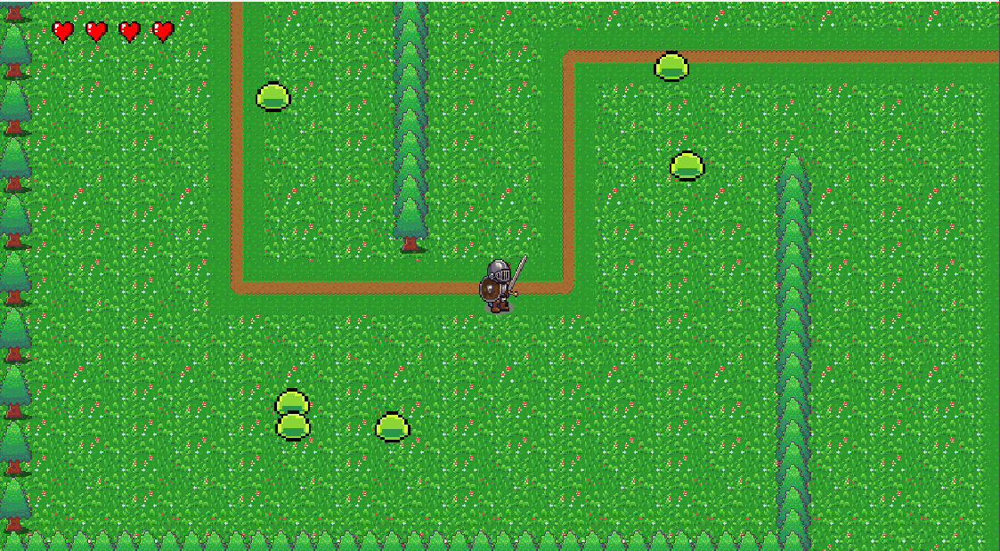

# Program Title (edit this)

My game is a 2d rpg where you play as a knight trying to travel the world.  The objective of my game is to progress each level with the first level needing you to get to the top right while the second level needs you to kill the large monster.  My game allows the player to control their character by walking around with the arrow keys.  They're also able to kill monsters by pressing c to swing their swords.  The game also has a restart function when you press r for players who made a mistake or want to restart their runthrough.  The mechanics of the game are very simple involving running around, cutting monsters, and picking up items.  There isn't any scoring in the game but there are lives which will deplete each time you touch a monster.  If your lives hit zero, you will lose the game and be required to press r to restart the game.  One thing to note is that my program does not allow your character to run so the movement speed you start with will be the same speed you'll be walking at for the whole game.  Additionally, my programs allows you to cut some monsters together at the same time but it won't allow you to cut all of them so don't be suprised if you can't cut 25 monsters at the same time.  

